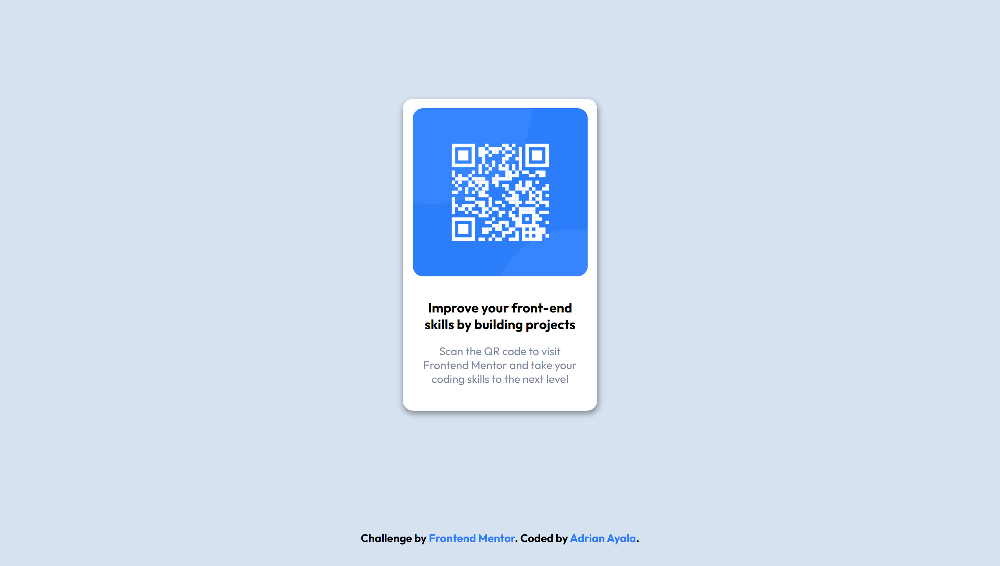
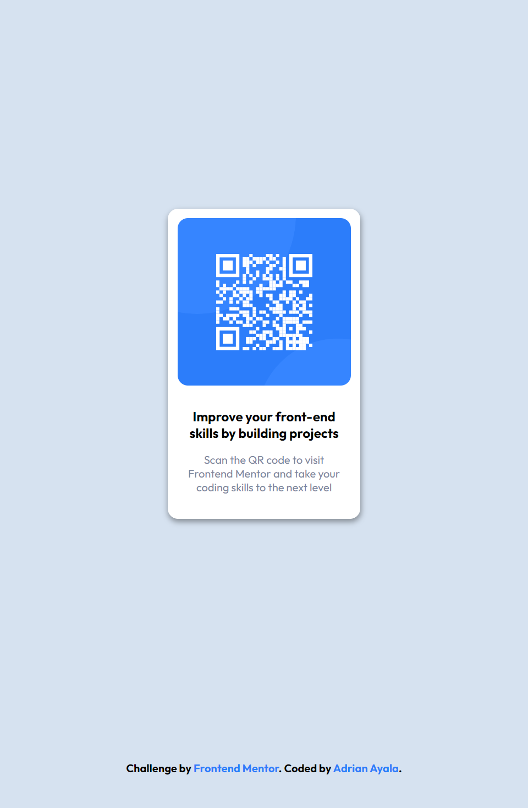

## Table of contents

- [Table of contents](#table-of-contents)
- [Overview](#overview)
- [Screenshot](#screenshot)
- [Links](#links)
- [Built with](#built-with)
- [Author](#author)

## Overview

A simple and minimalist challenge, with important elements for optimal viewing and interaction on different devices, without losing the proportions of the elements and the QR image

### Screenshot

 Desktop
 Tablet
 Mobile

### Links

- Solution URL: [Add solution URL here](https://your-solution-url.com)
- Live Site URL: [Add live site URL here](https://your-live-site-url.com)

### Built with

- Semantic HTML5 markup
- CSS custom properties
- Flexbox

## Author

- Frontend Mentor - [@Magik96x](https://www.frontendmentor.io/profile/Magik96x)
- GitHub - [@MagikMX](https://github.com/MagikMX)
